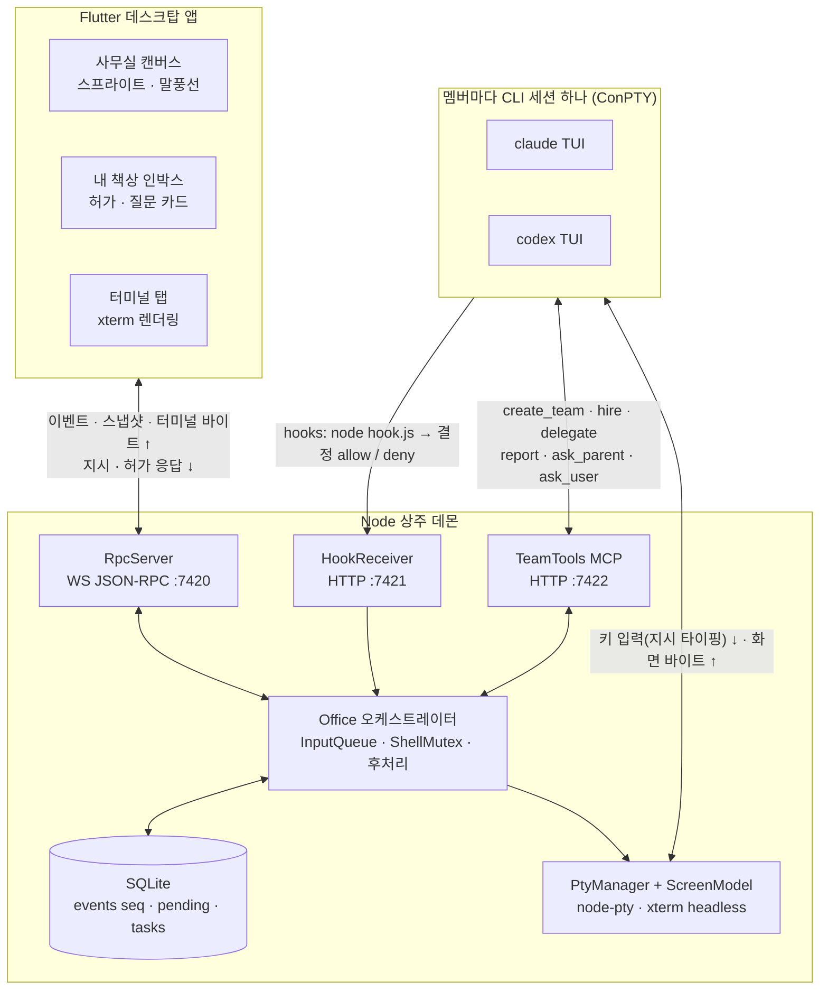
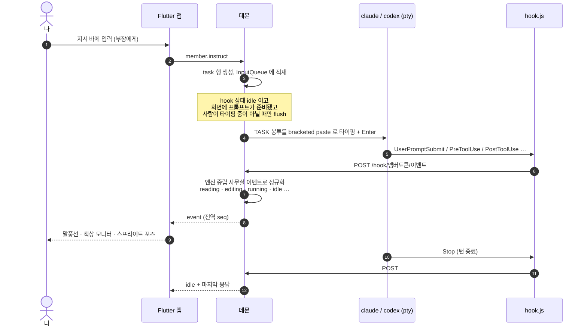
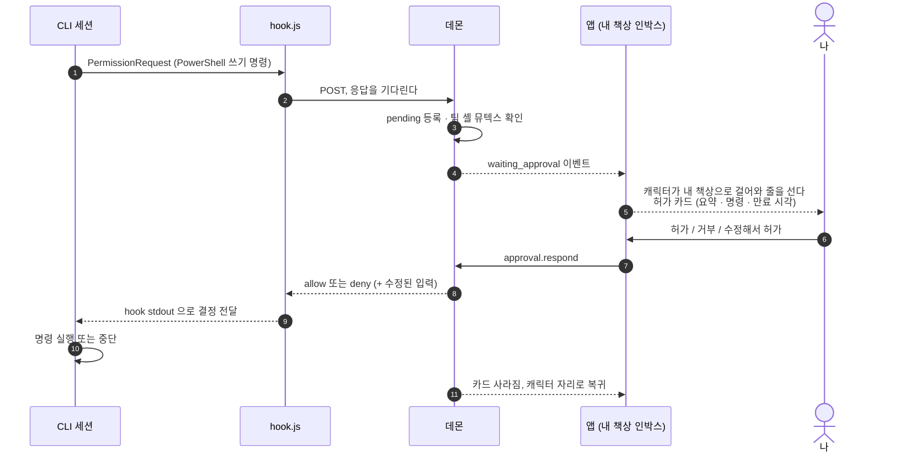
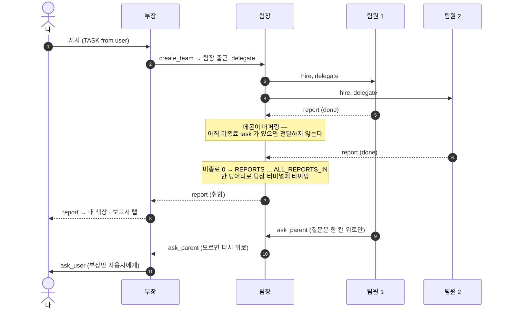
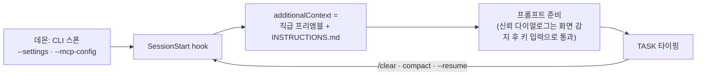
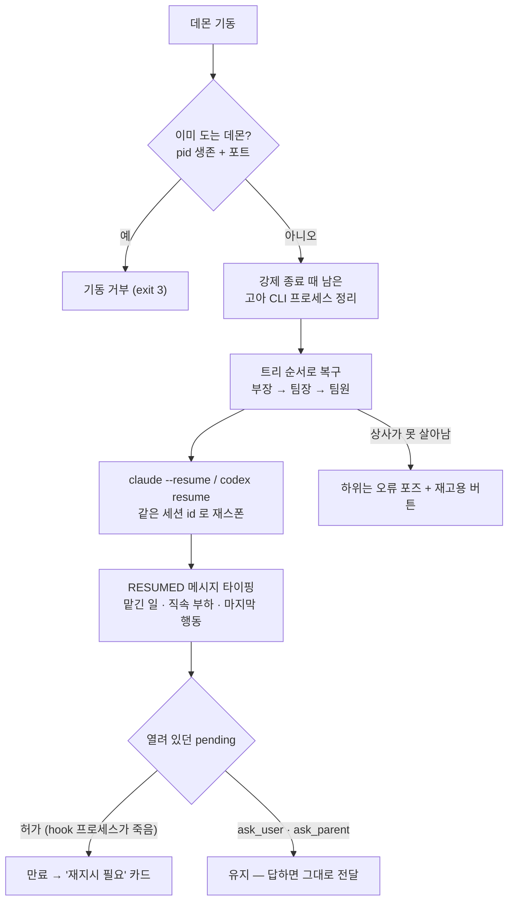

# 픽셀 오피스 (Pixel Office)

**AI 코딩 에이전트 팀을 픽셀아트 사무실에서 지휘하는 개인용 Windows 데스크탑 툴.**

---

**English summary.** Pixel Office is a personal Windows desktop tool for running a team of AI coding agents.
Each pixel-art character on screen is a real `claude` or `codex` CLI session: a Node daemon spawns the official
CLI binary inside a ConPTY, receives the CLI's own **hooks** to learn what the agent is doing, and types
instructions straight into that terminal. There is no SDK and no API key — it drives the CLIs you are already
logged into, so cost and rate limits are exactly what they are in your own terminal. A Flutter desktop app
renders the office, shows the shell-permission cards you have to answer, keeps the real terminal one tab away,
and collects reports. Agents are organised as a three-level tree (you → head → team lead → member) wired
through a small MCP server, so one agent can hire, delegate to, report to and question another.

---


## 무엇인가

**캐릭터 하나 = 실제 CLI 세션 하나다.** 상주 데몬이 수정하지 않은 공식 `claude` / `codex` 바이너리를
가상 터미널(ConPTY)에 띄우고, CLI 의 **hooks** 로 무슨 일이 벌어지는지 받고, 지시는 그 터미널에 그대로 타이핑한다.
그 결과를 Flutter 사무실에서 관전하고, 셸 허가를 내주고, 보고를 받는다.

**왜 이렇게 만들었나.** SDK 도 API 키도 쓰지 않는다. 이미 로그인해 쓰고 있는 구독 CLI 를 그대로 굴리므로
비용·한도가 지금 터미널에서 쓰는 것과 같고, 언제든 터미널 탭을 열어 사람이 직접 이어서 칠 수 있다.

조직은 **부서 → 부장 → 팀장 → 팀원** 3단 트리다. 내가 만드는 것은 **부서(= 프로젝트 폴더)와 부장**뿐이고,
부장이 팀을 만들어 팀장을 배치하고 팀장이 팀원을 고용한다. **지시는 아래로 한 칸씩, 보고·질문은 위로 한 칸씩.**
나는 셸 허가와 멤버별 지시문, 그리고 비상시 퇴근으로 개입한다.

```
나 ──부서 만들기(부장 임명)──▶ 부장(head) ──create_team──▶ 팀장(lead) ──hire──▶ 팀원(member)
 ◀──── 보고 · ask_user · 셸 허가 ────┘        ◀── 보고 · ask_parent ──┘     ◀── 보고 · ask_parent ──┘
```

## 기능

- **사무실 뷰** — 부서 = 상단 탭, 부장 책상 위, 팀별 책상 클러스터. 캐릭터가 걷고 앉고 타이핑하고 보고하러 간다.
- **내 책상 인박스** — 내가 답해야 하는 것만 모인다: 셸 허가 전부 + 부장의 질문. `Alt+Y` / `Alt+N`.
- **셸 허가 카드** — 명령 전문·위험 패턴·만료 시각. 허가 / 거부 / 수정해서 허가 / 이번 세션 항상 허가.
- **보고서 탭** — 보고가 문서 흐름으로 쌓이고 미확인 배지가 붙는다.
- **진짜 터미널 탭** — 그 멤버의 CLI TUI 그대로. 직접 타이핑해도 되고, 데몬이 방해하지 않는다.
- **조직 트리 + TeamTools MCP** — `create_team` · `hire` · `dismiss` · `delegate` · `reply` · `report` ·
  `ask_parent` · `ask_user`. 직급마다 보이는 도구가 다르다.
- **보고 버퍼링** — 자식들의 미종료 task 가 0 이 되면 `[REPORTS …][ALL_REPORTS_IN]` 한 덩어리로 부모에게 간다.
- **셸 뮤텍스** — 같은 팀의 쓰기 셸은 한 번에 하나. 도착 순 FIFO 로 풀린다.
- **재시작 복구** — 데몬이 죽었다 떠도 `claude --resume` / `codex resume` 으로 같은 문맥을 물고 되살아난다.
  세션이 오류로 죽으면 캐릭터가 붉은 링이 되고 **재고용** 버튼이 뜬다.
- **픽셀 스프라이트** — 32×32 아틀라스를 저장소의 결정적 생성기(`tool/gen_sprites.dart`)로 찍는다. AI 생성물 아님.

| | |
|---|---|
|  |  |
| 셸 허가 카드(명령 전문 · 만료) · 내 책상 차례 슬롯에 선 캐릭터 | 터미널 탭 — 그 멤버의 실제 CLI TUI |
|  |  |
| 부서 만들기 — 작업 폴더 · 부장 엔진 | 32×32 스프라이트 (8× 확대, 보간 없음) |


## 구조



데몬은 앱과 분리된 상주 프로세스다. 앱 창을 닫아도 CLI 세션은 계속 일하고, 다시 열면 `seq` 이후 이벤트만 받아 이어 본다.

## 어떻게 도는가

### 1. 지시 한 번이 화면에 보이기까지

지시는 API 호출이 아니라 **터미널에 타이핑**된다. 무슨 일이 벌어지는지는 화면을 긁지 않고 **CLI 의 hooks** 로 받는다.



- 화면은 `@xterm/headless` 로 재구성해(`ScreenModel`) "프롬프트가 준비됐나 / 다이얼로그가 떴나" 만 판정한다. 패턴은 CLI 버전별 JSON.
- hooks 는 스폰할 때 **세션 단위로** 주입한다(Claude `--settings`, Codex `.codex/hooks.json`). 사용자 전역 설정은 건드리지 않는다. 멤버 식별은 환경변수 `PIXEL_MEMBER`.

### 2. 셸 허가 — hook 결정이 TUI 프롬프트를 대체한다

CLI 가 y/n 을 묻는 대신, `PermissionRequest` hook 의 응답을 **사람이 답할 때까지 붙잡아 둔다**(최대 24시간).



같은 팀의 **쓰기 셸은 한 번에 하나**다. 두 번째 명령의 `PreToolUse` 응답은 앞 명령이 끝날 때까지 보류되고, 사무실에는 `셸 대기 중 (락: 누구)` 말풍선이 뜬다.

### 3. 조직 트리 — 지시는 아래로, 보고는 위로

고용·위임·보고·질문은 전부 **MCP TeamTools** 로 오간다. 데몬이 멤버 토큰마다 엔드포인트를 열어 CLI 에 주입하고(Claude `--mcp-config`, Codex `-c mcp_servers.team.url`), 직급 규칙은 데몬이 강제한다.



| 직급 | 쓸 수 있는 도구 |
|---|---|
| 부장 | `create_team` · `dismiss_team` · `delegate` · `reply` · `report`(→ 나) · `ask_user` |
| 팀장 | `hire` · `dismiss` · `delegate` · `reply` · `report`(→ 부장) · `ask_parent` |
| 팀원 | `report`(→ 팀장) · `ask_parent` |

### 4. 세션 시작 — 멤버는 자기가 누구인지 안다

멤버별 `INSTRUCTIONS.md` 를 `SessionStart` hook 의 `additionalContext` 로 넣는다. startup · resume · clear · compact 모두에서 다시 들어가므로 대화가 압축돼도 역할이 사라지지 않는다. 프로젝트의 `CLAUDE.md` / `AGENTS.md` 는 건드리지 않는다.



### 5. 데몬이 죽었다 살아날 때



## 기술 스택

- **데몬** — Node 24 + TypeScript, `node-pty`(ConPTY), `@xterm/headless`, `node:sqlite`, `ws`, MCP SDK, zod.
  테스트는 `node:test`.
- **앱** — Flutter 3.41 (Windows 데스크탑), Riverpod, `xterm`, `web_socket_channel`, `file_selector`.
  사무실은 `CustomPainter` 한 장(게임 엔진 없음).
- **에셋** — 스프라이트는 `tool/gen_sprites.dart` 가 찍는 32×32 아틀라스(CC0), 서체는 Galmuri11 · Pretendard ·
  D2Coding (전부 SIL OFL 1.1).

## 실행

사전 조건: **Node 24+**(데몬이 `node:sqlite` 를 쓴다), **Flutter**(Windows 데스크탑),
`claude` 실행 파일 + 로그인, (선택) `codex` + 로그인.

```bash
# 1) 데몬 — 먼저 떠 있어야 한다. 한 번에 하나만 뜬다.
cd dev/daemon
npm install
npm start                        # ws 7420 / hook 7421 / mcp 7422, 데이터 %LOCALAPPDATA%\pixel-office

# 2) 앱
cd dev/app
flutter pub get
flutter run -d windows           # 개발 실행
flutter build windows --release  # build\windows\x64\runner\Release\pixel_office.exe

# 앱 없이 데몬만 만져 보려면 (디버깅·시연용 REPL)
cd dev/daemon && npm run cli     # help 로 명령 목록
```

앱은 `%LOCALAPPDATA%\pixel-office\daemon.json` 에서 포트·토큰을 읽어 붙는다. 데몬이 없으면 회색 사무실 +
"데몬 시작" 버튼이 뜨고 계속 재접속을 시도한다.

첫 화면에서 **"부서 만들기"** → 작업 폴더(cwd) · 부서 이름 · 부장 이름 · 부장 엔진 → 부장이 출근한다.
그다음은 아래 지시 바로 **부장에게만** 말하면 된다.

## 테스트

```bash
cd dev/daemon && npm install && npx tsc --noEmit && npm test
#   → 511 pass · 7 skip (skip = PIXEL_IT=1 이 필요한 실제 CLI 통합 테스트)

cd dev/app && flutter pub get && flutter analyze && flutter test
#   → 446 pass · 1 skip, analyze 무경고
```

## 문서

- [docs/01-설계문서.md](docs/01-설계문서.md) — 설계, 직무 체계 rev 3, 실측 결과
- [docs/04-결정기록.md](docs/04-결정기록.md) — D-01~D-44, 뒤집을 조건까지 적은 결정 기록
- [docs/design/레이아웃-v2.md](docs/design/레이아웃-v2.md) — 레이아웃 v2 디자인 리뷰
- [dev/daemon/PROTOCOL.md](dev/daemon/PROTOCOL.md) — 앱과 데몬의 유일한 계약
- 폴더별 README: [dev/daemon](dev/daemon/README.md) · [dev/app](dev/app/README.md)

## 상태

**v1 (2026-09) — Windows 전용, 개인용 툴.** M0~M6 완료.
Codex 경로는 어댑터·MCP 주입·화면 패턴까지 실측 로그로 만든 단위 테스트가 덮고 있고,
**모델 턴이 필요한 Codex 실기 확인은 아직 남아 있다.** Claude 쪽 기능은 전부 실기로 닫혔다.

## 라이선스

코드는 [MIT](LICENSE).

에셋 출처와 라이선스는 [dev/app/assets/LICENSES.md](dev/app/assets/LICENSES.md) —
스프라이트는 `tool/gen_sprites.dart` 가 생성한 **CC0 1.0**, 서체 Galmuri11 · Pretendard · D2Coding 은 **SIL OFL 1.1**
(라이선스 전문은 `dev/app/assets/fonts/` 에 동봉).
