# 픽셀 오피스 (Pixel Office)

**AI 코딩 에이전트 팀을 픽셀아트 사무실에서 지휘하는 개인용 Windows 데스크탑 툴.**

---

**English summary.** Pixel Office is a personal Windows desktop tool for running a team of AI coding agents.
Each pixel-art character on screen is a real `claude` or `codex` CLI session: a Node daemon spawns the official
CLI binary inside a ConPTY, receives the CLI's own **hooks** to learn what the agent is doing, and types
instructions straight into that terminal. There is no SDK and no API key — it drives the CLIs you are already
logged into, so cost and rate limits are exactly what they are in your own terminal. A Flutter desktop app
renders the office, shows the shell-permission cards you have to answer, keeps the real terminal one tab away,
and collects reports. Agents are organised as a three-level tree (you → head → team lead → member) wired
through a small MCP server, so one agent can hire, delegate to, report to and question another.

---

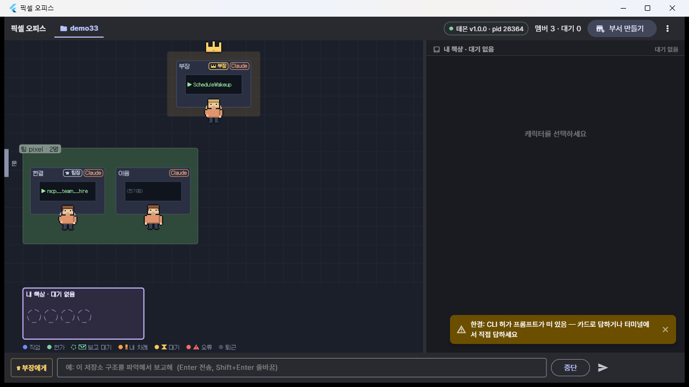

## 한눈에 보기

어려운 말을 빼고 여덟 줄로 줄이면 이렇다.

1. **덩어리는 셋이다.** 내가 보는 창(플러터 앱) · 뒤에서 계속 도는 관리 프로그램(데몬) · 실제로 일하는 AI 프로그램들(claude / codex).
2. **앱과 관리 프로그램은 한 컴퓨터 안에서 열어 둔 통로(웹소켓, 127.0.0.1)로 이어져 있다.** 내가 입력하면 이 통로로 간다.
3. **관리 프로그램은 AI 마다 보이지 않는 터미널 창(가상 터미널, pty)을 하나씩 열어 AI 를 띄운다.** 통로는 그 AI 가 사는 동안 계속 이어져 있다.
4. **AI 에게 말을 거는 방법은 하나뿐이다 — 그 보이지 않는 창에 대신 타이핑하는 것.** AI 는 사람이 친 것과 구별하지 못한다.
5. **AI 끼리는 직접 말하지 못한다.** AI 가 "이걸 저 사람에게 전해 줘" 하고 버튼(MCP 도구)을 누르면, 관리 프로그램이 받아서 상대의 창에 타이핑해 준다.
6. **버튼(MCP)은 AI 가 골라서 누르는 것이고, 센서(hook)는 자동으로 울리는 것이다.** 보고·질문·고용은 버튼, "지금 뭘 하는 중"·"이 명령 실행해도 되나" 는 센서.
7. **위험한 명령은 센서가 AI 를 멈춰 세우고 나에게 묻는다.** 내가 앱에서 허가를 눌러야 실행된다.
8. **나는 누구에게든 말할 수 있지만, 나에게 오는 것은 정해져 있다.** 허가 요청 전부 + 부장의 보고·질문. 나머지는 조직 안에서 위 직급이 처리한다.

## 무엇인가

**화면 속 캐릭터 하나가 실제 AI 프로그램 하나다.** 평소에 까만 터미널 창을 열고 `claude` 나 `codex` 를 실행해 글로 일을 시키는 것을,
터미널 여러 개 대신 **사무실 그림 하나**에서 한다. 캐릭터가 일하는 모습을 보고, 위험한 명령은 허가해 주고, 끝나면 보고를 받는다.

**왜 이렇게 만들었나.** AI 회사가 제공하는 개발자용 연결 방식(SDK, API 키)을 쓰지 않는다.
이미 구독해서 로그인해 둔 공식 프로그램을 **그대로** 실행하고 거기에 타이핑할 뿐이다.
그래서 비용과 사용 한도가 평소 터미널에서 쓰는 것과 똑같고, 언제든 캐릭터를 눌러 실제 터미널 화면을 열고 사람이 직접 이어서 칠 수 있다.

**조직은 회사처럼 생겼다.** 나 → 부장 → 팀장 → 팀원. 내가 만드는 것은 **부서(= 프로젝트 폴더)와 부장**뿐이다.
부장이 필요한 팀을 만들어 팀장을 앉히고, 팀장이 팀원을 뽑는다. **지시는 아래로 한 칸씩, 보고와 질문은 위로 한 칸씩.**

```
나 ── 부서 만들기(부장 임명) ──▶ 부장 ── 팀 만들기 ──▶ 팀장 ── 팀원 뽑기 ──▶ 팀원
 ◀──── 보고 · 질문 · 허가 요청 ────┘   ◀──── 보고 · 질문 ────┘   ◀──── 보고 · 질문 ────┘
```

## 기능

- **사무실 화면** — 부서마다 탭, 부장 책상이 위, 팀마다 색이 다른 카펫. 캐릭터가 걸어 들어오고, 앉아서 타이핑하고, 보고하러 걸어온다.
- **내 책상** — 내가 답해야 하는 것만 모인다. 위험한 명령의 허가 요청 전부와 부장의 질문. `Alt+Y` 허가 / `Alt+N` 거부.
- **허가 카드** — 무슨 도구로 무엇을 하려는지 한 줄 요약, 명령 전문, 위험한 명령 표시, 만료 시각. 허가 / 거부 / 고쳐서 허가 / 이번에는 계속 허가.
- **보고서 탭** — 올라온 보고가 문서처럼 쌓이고, 안 읽은 것에 배지가 붙는다.
- **진짜 터미널 탭** — 그 AI 의 실제 화면 그대로. 직접 타이핑해도 된다.
- **회사 조직** — 부장·팀장·팀원이 서로 일을 맡기고, 보고하고, 묻는다. 직급마다 할 수 있는 일이 다르다.
- **보고 모으기** — 팀원들의 보고는 하나씩 끼어들지 않고, 맡긴 일이 다 끝나면 한 묶음으로 팀장에게 간다.
- **한 번에 하나만** — 같은 팀에서 파일을 바꾸는 명령은 동시에 하나만 돈다. 나머지는 도착한 순서대로 기다린다.
- **껐다 켜도 이어진다** — 관리 프로그램이 죽었다 살아나도 AI 들이 아까 하던 대화를 그대로 물고 돌아온다. AI 가 오류로 죽으면 캐릭터에 붉은 테가 생기고 **재고용** 버튼이 뜬다.
- **픽셀 캐릭터** — 32×32 픽셀 그림을 저장소 안의 코드(`tool/gen_sprites.dart`)가 찍어 낸다. AI 가 생성한 그림이 아니다.

| | |
|---|---|
| 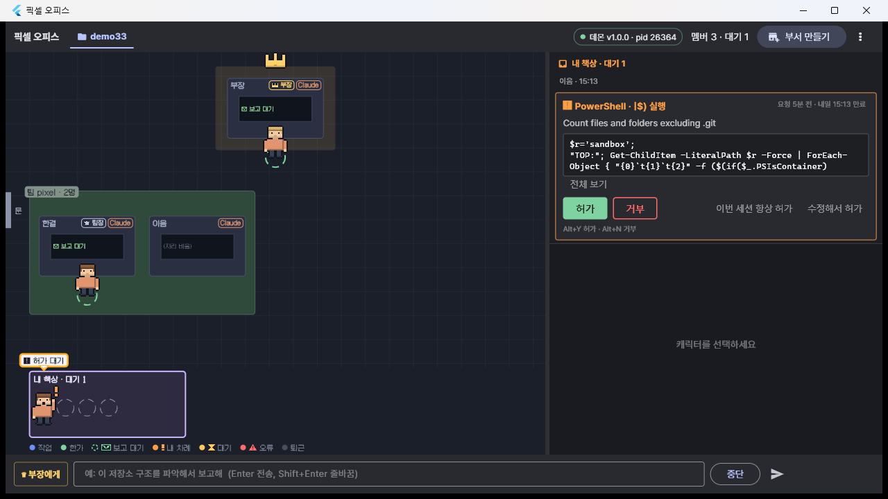 | 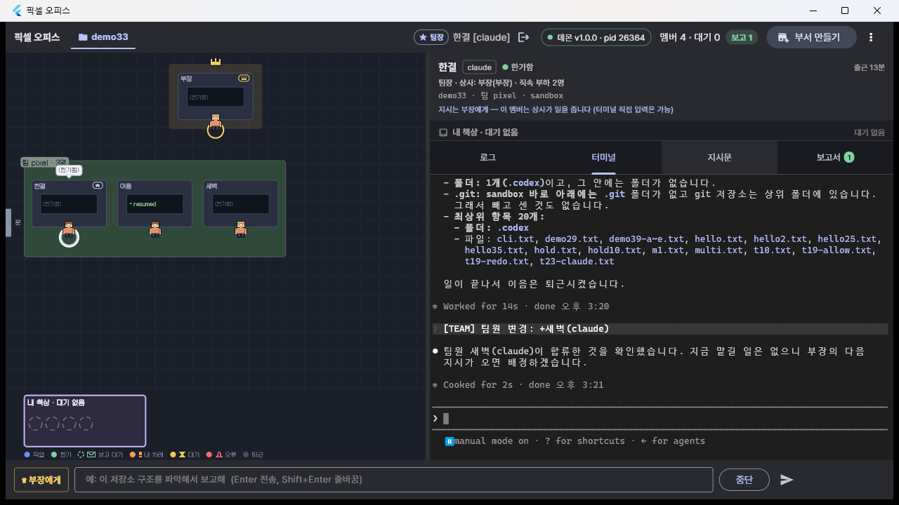 |
| 허가 카드 · 내 책상 앞에 줄 선 캐릭터 | 터미널 탭 — 그 AI 의 실제 화면 |
| 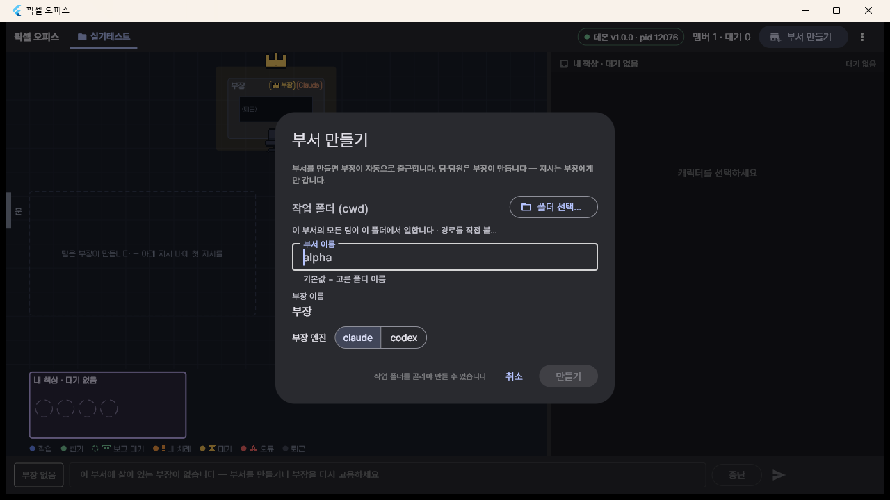 |  |
| 부서 만들기 — 폴더만 고르면 된다 | 캐릭터 8배 확대 — 픽셀이 뭉개지지 않는다 |

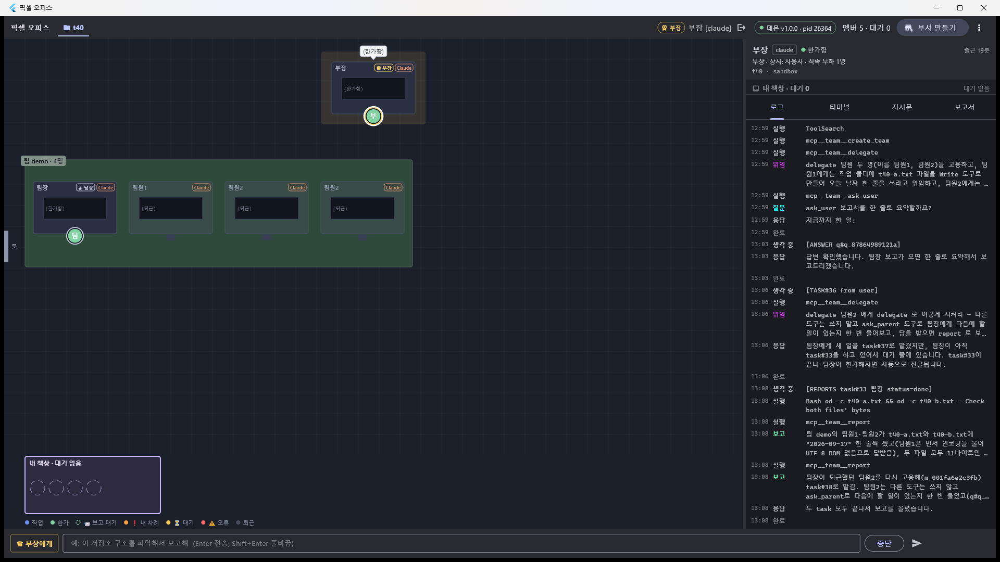

## 구성 — 덩어리 셋

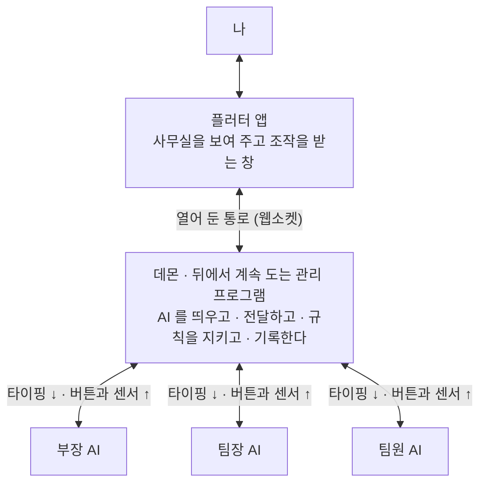

| 덩어리 | 하는 일 | 개수 |
|---|---|---|
| **플러터 앱** | 사무실을 그림으로 보여 주고, 내 지시와 허가를 관리 프로그램에 전한다. 화면일 뿐, 일은 하지 않는다 | 1개 · 껐다 켜도 된다 |
| **데몬** (뒤에서 계속 도는 프로그램) | AI 들을 띄우고, 모든 전달을 중계하고, 규칙을 지키게 하고, 허가를 받아 주고, 전부 기록한다 | 1개 · 항상 떠 있다 |
| **AI 프로그램** (`claude` / `codex`) | 실제로 생각하고, 파일을 고치고, 명령을 실행한다 | 캐릭터 수만큼 |

**앱과 AI 사이, AI 와 AI 사이에는 직접 연결이 없다. 전부 데몬 한 곳을 지난다.**
길이 하나이기 때문에 그 길목에서 규칙을 검사하고, 보고를 모으고, 모든 일을 기록할 수 있다.

> **비유.** 데몬은 24시간 돌아가는 **사무실 건물**이고, 앱은 그 사무실을 들여다보는 **모니터 겸 인터폰**이다.
> 모니터를 꺼도 사무실 사람들은 계속 일하고, 다시 켜면 그동안 있었던 일을 이어서 본다.
> 나중에 휴대폰 앱을 만들어도 같은 건물에 연결하기만 하면 된다 — 데몬을 앱과 따로 떼어 놓은 이유다.

## 어떻게 도는가

### 1. AI 에게 말 거는 법 — 보이지 않는 창에 대신 타이핑

`claude` 같은 프로그램은 자기가 터미널 창에 연결돼 있다고 믿어야 정상적으로 뜬다.
그래서 데몬은 AI 를 띄울 때 **화면에 안 보이는 가짜 창(가상 터미널, pty)** 을 하나 만들어 준다. 이 창의 반대쪽 끝을 데몬이 쥐고 있다.

- 데몬이 그 끝에 **글자를 넣으면** → AI 는 "사람이 키보드를 쳤구나" 하고 받는다.
- AI 가 화면에 **뭔가 그리면** → 그 내용이 데몬 쪽으로 흘러나온다.

둘 사이는 운영체제가 놓아 준 **두 줄의 관(파이프)** 이다. 하나는 키 입력이 들어가는 관, 하나는 화면 내용이 나오는 관.
AI 를 띄우는 순간 연결되고, 그 AI 가 사는 동안 계속 이어져 있다. 캐릭터가 넷이면 이런 창도 넷이다.

지시는 바로 치지 않는다. 캐릭터마다 **대기 줄**이 있고, 아래 셋이 모두 맞을 때만 타이핑한다.

| 조건 | 왜 |
|---|---|
| AI 가 지금 일하는 중이 아닐 것 | 일하는 도중에 글이 끼어들면 엉뚱하게 해석된다 |
| 창에 글 쓰는 칸이 떠 있을 것 (안내 창이 떠 있으면 안 됨) | "실행할까요? 예/아니오" 가 떠 있는데 글자가 들어가면 첫 글자가 "예" 로 눌릴 수 있다 |
| 사람이 직접 치고 있지 않을 것 (3초) | 터미널 탭에서 내가 치는 글과 섞이지 않게 |

여러 줄짜리 지시는 **붙여넣기 방식**으로 한 번에 넣고 마지막에 엔터를 누른다. 한 글자씩 치면 첫 줄바꿈에서 전송돼 버리기 때문이다.

### 2. AI 가 데몬에게 말하는 두 가지 길 — 버튼과 센서

| | 버튼 (MCP 도구) | 센서 (hook) |
|---|---|---|
| 한 줄 설명 | AI 에게 쥐여 준 **버튼** | AI 프로그램에 달아 둔 **자동 센서** |
| 누가 작동시키나 | **AI 가 골라서 누른다.** 쓸지 말지, 뭐라고 쓸지 AI 가 정한다 | **자동으로 울린다.** AI 는 센서가 있는지도 모른다 |
| 무엇에 쓰나 | 보고 · 질문 · 팀 만들기 · 팀원 뽑기 · 일 맡기기 | "지금 파일 읽는 중 / 고치는 중 / 끝남" 알림, **"이 명령 실행해도 되나"** |
| 왜 이쪽인가 | 내용을 AI 가 생각해서 정해야 하니까 | 빠지면 안 되니까. 특히 허가는 AI 가 깜빡하거나 건너뛸 수 없어야 한다 |
| 회사 비유 | 직원에게 준 **사내 메신저** | 사무실 **출입문 센서와 금고 잠금장치** |

**버튼 9개** — 직급마다 보이는 버튼이 다르다.

| 버튼 | 하는 일 | 부장 | 팀장 | 팀원 |
|---|---|:-:|:-:|:-:|
| `create_team` | 팀을 만들고 팀장을 앉힌다 | ● | | |
| `dismiss_team` | 팀을 해산한다 | ● | | |
| `hire` | 팀원을 뽑는다 | | ● | |
| `dismiss` | 팀원을 내보낸다 | | ● | |
| `delegate` | 바로 아래 사람에게 일을 맡긴다 | ● | ● | |
| `reply` | 아래 사람의 질문에 답한다 | ● | ● | |
| `report` | 맡은 일의 결과를 바로 위로 올린다 | ● → 나 | ● → 부장 | ● → 팀장 |
| `ask_parent` | 바로 위 사람에게 묻는다 | | ● | ● |
| `ask_user` | 나에게 직접 묻는다 | ● | | |

**센서 가운데 중요한 것**

| 센서 | 언제 울리나 | 데몬이 하는 일 |
|---|---|---|
| 시작 (`SessionStart`) | AI 프로그램이 켜졌을 때 | 역할 안내문을 넣어 준다 |
| 도구 쓰기 직전 (`PreToolUse`) | 파일을 읽거나 고치거나 명령을 실행하기 직전 | 사무실에 "읽는 중 · 고치는 중 · 실행 중" 을 띄운다. 같은 팀에서 위험한 명령이 이미 돌고 있으면 **차례가 올 때까지 붙잡아 둔다** |
| **허가 요청 (`PermissionRequest`)** | 허가가 필요한 명령을 실행하려 할 때 | **AI 를 멈춰 세우고** 내 책상에 허가 카드를 띄운 뒤, 내가 누른 답을 돌려준다 |
| 끝남 (`Stop`) | 한 차례 일이 끝났을 때 | "한가함" 으로 바꾼다. AI 가 보고 버튼을 깜빡했으면 마지막에 한 말을 보고로 대신 올린다 |
| 꺼짐 (`SessionEnd`) | AI 프로그램이 꺼질 때 | 퇴근 처리. 비정상이면 붉은 테 + 재고용 버튼 |

**"지금 뭘 하는 중인지" 는 화면 글자를 읽어서 알아내지 않는다.** 화면 글자는 AI 프로그램이 업데이트될 때마다 모양이 바뀌어 믿기 어렵다.
가짜 창은 **말을 거는 통로**, 센서와 버튼은 **소식을 듣는 통로**다.

### 3. 지시 한 번의 여정

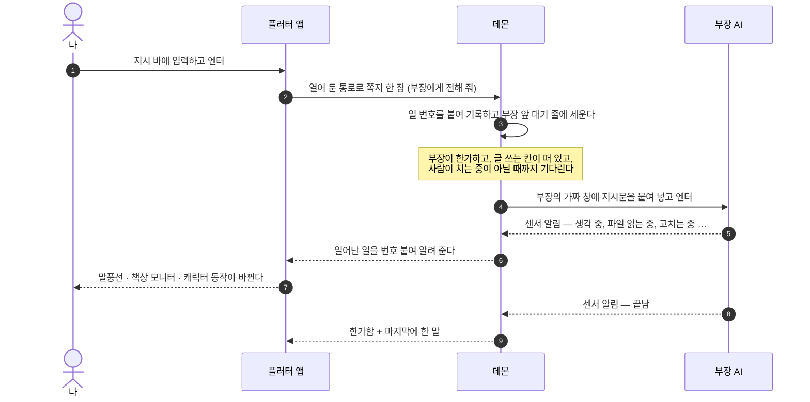

앱이 하는 일은 "쪽지 보내기" 와 "오는 소식을 그림으로 바꾸기" 뿐이고, 실제로 AI 에게 타이핑하는 것은 전부 데몬이다.

### 4. 위험한 명령은 나에게 묻는다

AI 프로그램은 원래 위험한 명령 앞에서 터미널에 "실행할까요?" 를 띄운다. 여기서는 센서가 그 질문을 가로채 **내 앱 화면으로 가져온다.**

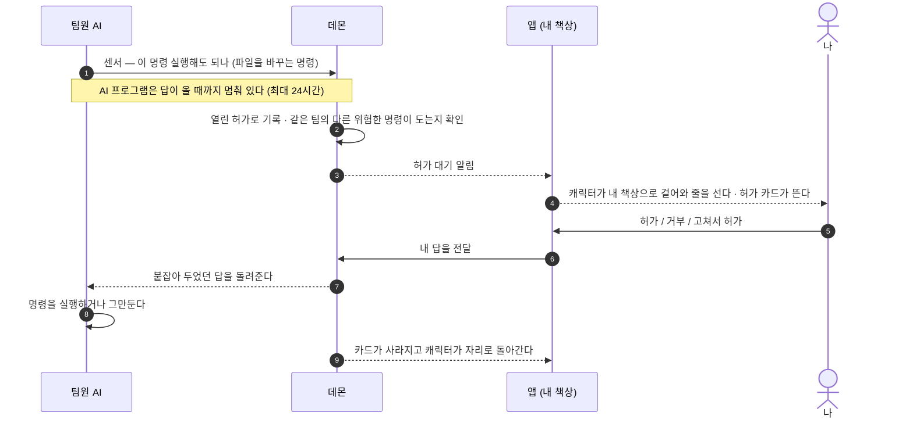

허가는 **직급과 상관없이 전부 나에게** 온다. 보고 체계와는 별개인 안전 문제이기 때문이다.

### 5. 지시는 아래로, 보고는 위로

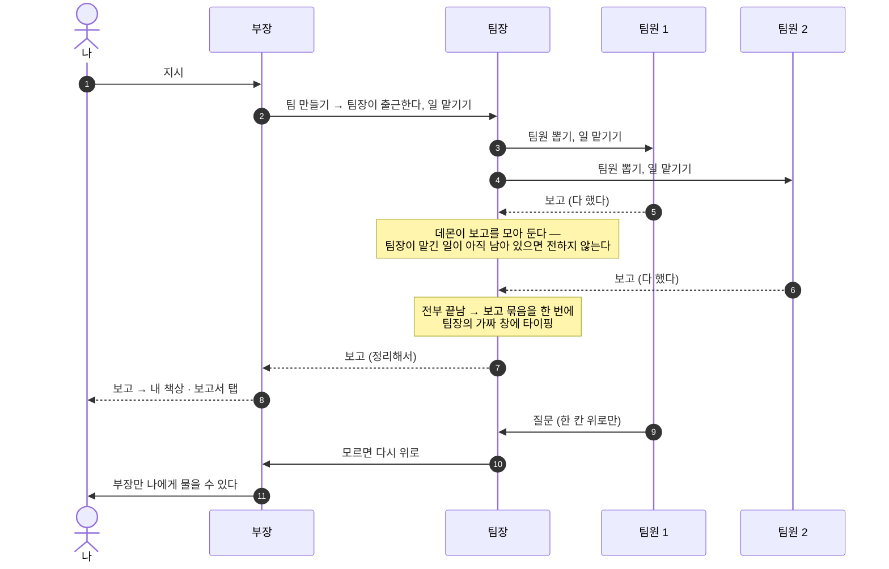

그림의 화살표는 전부 **데몬을 거친다** — 보내는 쪽이 버튼을 누르면 데몬이 조직도를 확인하고 받는 쪽의 가짜 창에 타이핑한다.
규칙에 어긋나면(예: 팀원이 부장에게 직접 보고) 데몬이 거절하고 이유를 돌려준다.

**무엇이 나에게 오나**

| AI 가 내보내는 것 | 나에게 오나 |
|---|---|
| 허가 요청 | **전부 온다** — 누구 것이든 내 책상에 카드로 |
| 보고 · 질문 | **부장 것만.** 팀원 것은 팀장이, 팀장 것은 부장이 읽고 처리한다. 거기서 안 풀리면 한 칸씩 올라온다 |
| "읽는 중 · 고치는 중" 같은 상황 | 전부 — 말풍선과 캐릭터 움직임으로 |
| 터미널 화면 | 내가 그 캐릭터의 터미널 탭을 열었을 때만 |

나는 한 명이고 AI 는 여럿이라 이렇게 비대칭이다. **나는 누구에게든 말할 수 있고(터미널 탭에서 직접 타이핑), 나에게 말을 걸 수 있는 것은 정해져 있다.**
아래에서 처리된 것도 사라지지 않는다 — 전부 기록에 남아 그 캐릭터를 눌러 볼 수 있다.

> **일을 어떻게 나눌지는 데몬이 정하지 않는다.** 누구에게 무엇을 맡길지, 언제 사람을 뽑을지는 부장·팀장 AI 가 스스로 판단한다.
> 데몬은 그 결정이 규칙 안에서, 제때, 정확한 상대에게 전달되게 하고 기록할 뿐이다. 판단은 하지 않고 운영만 하는 관리자다.

### 6. AI 는 자기 역할을 잊지 않는다

캐릭터마다 **역할 안내문**(`INSTRUCTIONS.md`)이 있고 앱에서 고칠 수 있다. "너는 부장이고, 이런 버튼이 있고, 일은 이렇게 나눠라."
이 안내문을 AI 가 **켜질 때마다** 센서를 통해 넣어 준다. 대화가 길어져 앞부분이 요약·정리돼도 다시 들어가므로 역할이 사라지지 않는다.
프로젝트 폴더의 공용 규칙 파일(`CLAUDE.md` / `AGENTS.md`)은 건드리지 않는다.

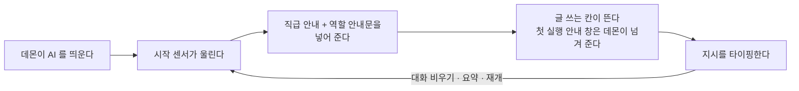

### 7. 껐다 켜도 이어진다

데몬이 꺼지면 가짜 창도 같이 닫혀 AI 들도 끝난다. 끊긴 창을 다시 붙잡는 방법은 없으므로, 데몬은 다시 켜질 때 **AI 를 새로 띄우고 "아까 그 대화를 이어서" 로 기억을 되살린다.**

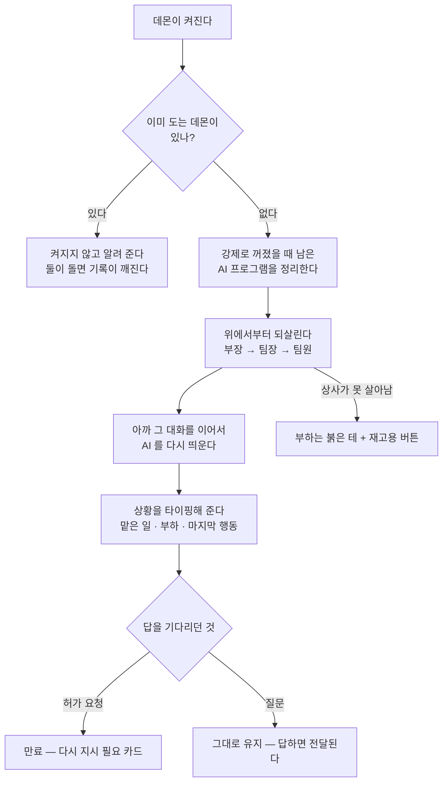

## 데몬이 하는 일 정리

| | 하는 일 |
|---|---|
| 1 | **나 ↔ AI** — 지시를 내려보내고, 허가 요청 · 상황 · 보고를 올려 보낸다 |
| 2 | **AI 띄우기** — 가짜 창을 만들어 띄우고, 끄고, 죽으면 되살린다 |
| 3 | **AI ↔ AI** — 전달을 중재하고 조직 규칙을 지키게 한다 |
| + | 이 모든 과정을 번호 붙여 **기록**한다. 그래서 껐다 켜도 이어진다 |

띄우기와 중계만 있으면 "AI 여러 개를 동시에 돌리는 도구" 다. **허가가 데몬을 거쳐 내 화면으로 온다**는 점이 이걸 "사무실에서 지휘하는 도구" 로 만든다.

<details>
<summary><b>개발자용 — 데몬 내부 구성과 포트</b></summary>

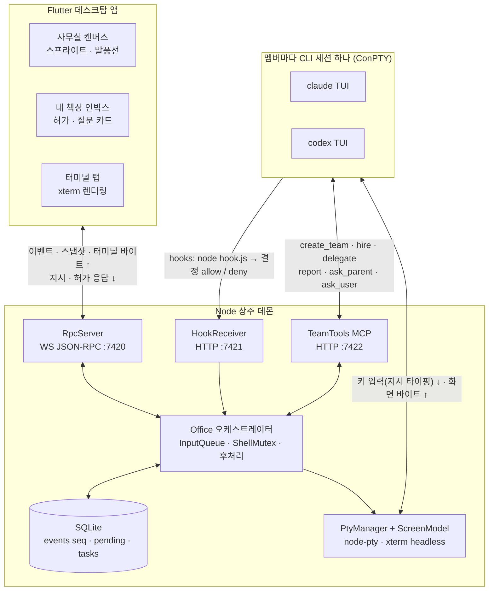

| 구간 | 연결 방식 | 오가는 것 |
|---|---|---|
| 앱 ↔ 데몬 | 웹소켓 JSON-RPC 2.0, `127.0.0.1:7420`, 토큰은 `daemon.json` | `member.instruct` · `approval.respond` … ↔ `event`(전역 `seq`) · `snapshot` · `term` |
| 데몬 → AI | ConPTY 입력 파이프 (`node-pty`) | bracketed paste 로 감싼 지시문 + `\r` |
| AI → 데몬 | ConPTY 출력 파이프 | TUI 화면 바이트 → `@xterm/headless` 로 재구성(`ScreenModel`), 앱 터미널 탭으로 중계 |
| AI → 데몬 | hooks: `node hook.js` 가 `HTTP :7421` 로 POST | `PreToolUse` · `PermissionRequest`(응답 보류, 상한 86400초) · `Stop` … |
| AI → 데몬 | MCP Streamable HTTP, `:7422/mcp/<멤버 토큰>` | 팀 도구 9종. 직급은 요청마다 DB 에서 다시 읽어 검사 |

- hooks 와 MCP 는 띄울 때 **그 세션에만** 주입한다(Claude `--settings` · `--mcp-config`, Codex `.codex/hooks.json` · `-c mcp_servers.team.url`). 사용자 전역 설정은 건드리지 않는다. 멤버 식별은 환경변수 `PIXEL_MEMBER`.
- Claude 와 Codex 의 서로 다른 hook 이벤트는 어댑터가 같은 "사무실 이벤트" 11종으로 바꾼다. 앱은 어느 엔진인지 모른다.
- 전체 메시지 목록은 [dev/daemon/PROTOCOL.md](dev/daemon/PROTOCOL.md).

</details>

## 용어 풀이

| 쉬운 말 | 용어 | 뜻 |
|---|---|---|
| 뒤에서 계속 도는 관리 프로그램 | 데몬 (daemon) | 화면 없이 상주하면서 다른 프로그램의 요청을 받아 주는 프로그램. 윈도우의 "서비스" 와 같은 개념 |
| 보이지 않는 터미널 창 | 가상 터미널 (pty, 윈도우에서는 ConPTY) | 프로그램이 "터미널에 연결돼 있다" 고 믿게 해 주는 가짜 창. 한쪽 끝은 프로그램, 반대쪽 끝은 그걸 띄운 쪽이 쥔다 |
| 두 줄의 관 | 파이프 (pipe) | 운영체제가 두 프로그램 사이에 놓아 주는 한 방향 통로. 넣은 순서대로 나온다 |
| 열어 둔 통로 | 웹소켓 (WebSocket) | 한 번 연결해 두고 양쪽이 아무 때나 말할 수 있는 통로. 데몬이 먼저 소식을 밀어 줄 수 있어서 쓴다 |
| 버튼 | MCP 도구 | AI 프로그램에 새 도구를 끼워 넣는 규격(MCP). 도구를 제공하는 쪽이 서버 — 여기서는 데몬이 서버다 |
| 자동 센서 | 훅 (hook) | AI 프로그램이 특정 순간마다 자동으로 실행해 주는 알림. 일부는 답을 기다리며 멈춘다 |
| 역할 안내문 | `INSTRUCTIONS.md` | 캐릭터마다 따로 두는 지시문. 켜질 때마다 다시 주입된다 |
| 부서 | department | 프로젝트 폴더 하나. 그 안의 모든 AI 가 이 폴더에서 일한다 |

## 기술 스택

- **데몬** — Node 24 + TypeScript, `node-pty`(ConPTY), `@xterm/headless`, `node:sqlite`, `ws`, MCP SDK, zod.
  테스트는 `node:test`.
- **앱** — Flutter 3.41 (Windows 데스크탑), Riverpod, `xterm`, `web_socket_channel`, `file_selector`.
  사무실은 `CustomPainter` 한 장(게임 엔진 없음).
- **에셋** — 스프라이트는 `tool/gen_sprites.dart` 가 찍는 32×32 아틀라스(CC0), 서체는 Galmuri11 · Pretendard ·
  D2Coding (전부 SIL OFL 1.1).

## 실행

사전 조건: **Node 24+**(데몬이 `node:sqlite` 를 쓴다), **Flutter**(Windows 데스크탑),
`claude` 실행 파일 + 로그인, (선택) `codex` + 로그인.

```bash
# 1) 데몬 — 먼저 떠 있어야 한다. 한 번에 하나만 뜬다.
cd dev/daemon
npm install
npm start                        # ws 7420 / hook 7421 / mcp 7422, 데이터 %LOCALAPPDATA%\pixel-office

# 2) 앱
cd dev/app
flutter pub get
flutter run -d windows           # 개발 실행
flutter build windows --release  # build\windows\x64\runner\Release\pixel_office.exe

# 앱 없이 데몬만 만져 보려면 (디버깅·시연용 REPL)
cd dev/daemon && npm run cli     # help 로 명령 목록
```

앱은 `%LOCALAPPDATA%\pixel-office\daemon.json` 에서 포트·토큰을 읽어 붙는다. 데몬이 없으면 회색 사무실 +
"데몬 시작" 버튼이 뜨고 계속 재접속을 시도한다.

첫 화면에서 **"부서 만들기"** → 작업 폴더(cwd) · 부서 이름 · 부장 이름 · 부장 엔진 → 부장이 출근한다.
그다음은 아래 지시 바로 **부장에게만** 말하면 된다.

## 테스트

```bash
cd dev/daemon && npm install && npx tsc --noEmit && npm test
#   → 511 pass · 7 skip (skip = PIXEL_IT=1 이 필요한 실제 CLI 통합 테스트)

cd dev/app && flutter pub get && flutter analyze && flutter test
#   → 446 pass · 1 skip, analyze 무경고
```

## 문서

- [docs/01-설계문서.md](docs/01-설계문서.md) — 설계, 직무 체계 rev 3, 실측 결과
- [docs/04-결정기록.md](docs/04-결정기록.md) — D-01~D-44, 뒤집을 조건까지 적은 결정 기록
- [docs/design/레이아웃-v2.md](docs/design/레이아웃-v2.md) — 레이아웃 v2 디자인 리뷰
- [dev/daemon/PROTOCOL.md](dev/daemon/PROTOCOL.md) — 앱과 데몬의 유일한 계약
- 폴더별 README: [dev/daemon](dev/daemon/README.md) · [dev/app](dev/app/README.md)

## 상태

**v1 (2026-09) — Windows 전용, 개인용 툴.** M0~M6 완료.
Codex 경로는 어댑터·MCP 주입·화면 패턴까지 실측 로그로 만든 단위 테스트가 덮고 있고,
**모델 턴이 필요한 Codex 실기 확인은 아직 남아 있다.** Claude 쪽 기능은 전부 실기로 닫혔다.

## 라이선스

코드는 [MIT](LICENSE).

에셋 출처와 라이선스는 [dev/app/assets/LICENSES.md](dev/app/assets/LICENSES.md) —
스프라이트는 `tool/gen_sprites.dart` 가 생성한 **CC0 1.0**, 서체 Galmuri11 · Pretendard · D2Coding 은 **SIL OFL 1.1**
(라이선스 전문은 `dev/app/assets/fonts/` 에 동봉).
